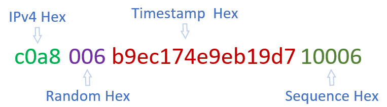

# GUID 生成

参考雪花算法

## 字符串类型的GUID生成策略

```
String 类型的GUID，兼顾长度和可读性，所有数据转成16进制

16进制IP（4个字符）+ 固定随机值（3个字符）+ 16进制时间戳（15个字符） + 循环递增值（5个字符）-> 27个字符
```



## Long类型的GUID生成策略

```
Long 类型的GUID，63位可用
策略1 ： 41位给ms时间戳（可以用到2074年），10位给svrId（即支持1024个节点），剩余12位给循环递增值，即1ms内4096个。需要考虑svrId的生成，适合大流量系统。
策略2 ： 30位给s级时间戳的低30位（可以用到2038-01-19），32位给IP地址（视情况可以去掉一些位），剩余1位给循环递增值，即1s内支持2个。无需考虑svrId,适合小流量系统，实现上可以视使用情况，通过参数分别控制三者的位数。
        节点不多时，很可能节点ip的差异只在低16位，此时可以设置ipDigits为16位，则递增值扩大到了17位，即支持2^17 qps
```

