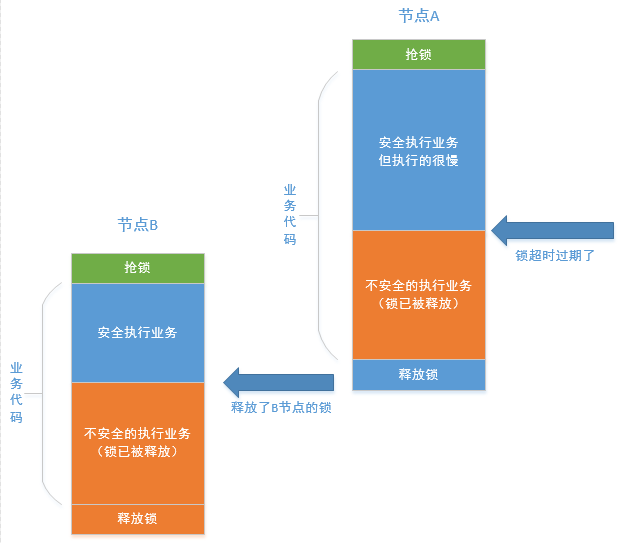

# Redis分布式锁

## 原理

分布式锁的实现原理大同小异。一种，是把对锁的争抢，通过网络请求从多机（分布式）转移到单机，然后借助单机中保证原子性的API争抢资源；另一种，是借助集群分布式事务的原子性来争抢资源。

各种基于redis、mysql、zookeeper等等分布式锁实现，本质上的原理同上面是一样的

- redis的高可用集群是多主多从模型，而且每个key落在hash槽（主节点）的位置是固定的，所以同一个锁（key）的争抢请求实际会在单个主节点中争抢。
- zookeeper集群，表面上看，它是通过临时节点的序列号做比较来判断到底谁抢到了锁，但临时节点序号的生成又是怎么保证原子性的呢？一样的道理， zookeeper集群会有唯一的一个leader节点处理所有的写请求，follower节点的写请求也会被转发到leader节点，leader节点处理完后广播给个follower节点。
- mysql的高可用模型非常多， 最常见的是主从模型，这种情况下，实际也是借助mysql单机事务的原子性来实现对资源（分布式锁）的争抢。

## 基于Redis的分布式锁

基于redis实现一把高可用的锁， 必须实现以下逻辑

### 锁必须有过期逻辑

为防止在进程抢占锁之后，在未释放锁之前进程crash造成锁永远被占用（死锁），分布式锁必须有过期时间

### 锁副本必须有唯一标识

分布式系统中，每个节点都按照锁的key构造了一把锁实例，此时每个节点拿的应该叫锁的副本。

1. 拿到同一个锁副本的线程要支持可重入
2. 不能释放非自身占用的锁（别人的锁副本）

要支持这两点，每一个锁副本必须具备一个唯一标识，所以，锁的结构应该是这样

```json
{
	"key" : "uid:1234:create_order",  // 锁的唯一标识，所有节点相同
	"ns" : "cebf8e72-18be-4d9d-98ad", // 锁副本的唯一标识
	"expireTime" : 36000			  // 超时过期时间
}
```

可重入这点好理解，虽然使用的并不多，但不代表不存在，因此必须支持。

那什么时候会去释放别人占用的锁副本呢？

假如锁副本没有唯一标识。 试想这样一种情况： 节点A先拿到锁，但是执行时间突然超长，在此之前锁自动过期了。此时节点B冲进来（这其实也是不应该的）拿到锁开始执行自己的业务，意外的是，节点A在节点B没执行完之前，先一步执行到了unlock，此时就会把节点B的锁给释放掉，此时节点B就变得不安全。（比如你正在房间里换衣服，你舍友没注意到，去把门打开了，此时外面一大群豺狼虎豹正抢着进来，后果可想而知）。流程如下图




### 锁不能提前过期

前面提到的当前节点，其它节点乱入的根本原因， 是因为锁提前过期了。前面提到的锁的默认超时时间是固定的，那么不论你设置成多长的超时时间，都会有问题。如果超时时间太短，则很容易因为运行时间过长出现提前过期的情况；如果设置的时间太短，则一旦进程出现crash，锁将被占用很长时间，这不一定是上层业务想看到的。

那么怎么解决这个问题呢？

答案自然是：非固定的过期时间，而且是视业务代码执行效率自动延长的过期时间。

假如业务代码平时执行只需要200ms，我们把初始超时时间设置为3s，并且每隔1s检查一下业务代码是否执行完毕，若没有则重新设置超时时间为3s。直到业务代码执行完毕主动释放锁，或者进程crash掉了，那么超时过期时间就从最后一次检查开始算3s

