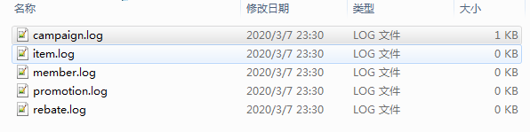
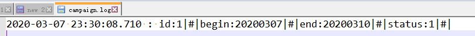

# 10秒钟完成日志模块化

## 一、背景

业务开发中常常有这样的场景， 好几个人在同一个项目中，负责不同的业务模块，比如在一个商城系统中，老王负责会员（member）和返现（rebate）模块；老李负责商品（item）和促销（promotion）模块；老吕负责活动（campaign）模块。

业务刚起步，团队很小，没那么多预算去搞微服务， 大家只共享一个应用（同一套代码）一块写代码。这时就遇到个问题，他们都有输出日志的需求，而且都不希望自己的日志不被别人输出的日志干扰。怎么办呢？

解决办法自然是将日志按照业务模块划分，每个业务模块打日志都输出到独立的文件/文件夹中去，互不影响。

在此向大家介绍一款简单配置即可非常快速完成日志模块化的工具，基于spring-boot，支持logback和log4j2，要求java版本>=8。

## 二、工具介绍

### 2.1 配置接入

在项目中引入依赖：

```xml
<dependency>
   <groupId>io.github.lvyahui8</groupId>
   <artifactId>feego-common-logging-starter</artifactId>
   <version>1.0.0</version>
</dependency>
```

在任意一个类上增加注解 `@ModuleLoggerAutoGeneration`。**当然也可以分多次注解在不同模块的不同类上**。

```java
@Configuration
@ModuleLoggerAutoGeneration({"member","rebate","item","promotion","campaign"})
public class LoggingConfiguration {
}
```

### 2.2 用法

**编译时期将自动生成一个SystemLogger枚举类，老王老李们可以通过这个枚举类来记录日志**， 我们可以在注解所在模块的编译目录`target\generated-sources` 下找到它，内容如下：

```java
public enum SystemLogger implements ModuleLogger { 
  member,
  rebate,
  item,
  promotion,
  campaign,
  ;

  @Override
  public Logger getInnerLogger() {
    return ModuleLoggerRepository.getModuleLogger(this.name());
  }
}
```

它支持slf4j标准接口（`org.slf4j.Logger`）的所有方法，除此之外， 还扩展了下列方法：

```java
void trace(LogSchema schema) 
void debug(LogSchema schema) 
void info(LogSchema schema) 
void warn(LogSchema schema) 
void error(LogSchema schema) 
```

使用方法非常简单， 以活动（campaign）模块要记录一条`info`级别日志为例，代码如下：

```java
SystemLogger.campaign.info(
   LogSchema.empty().of("id",1).of("begin",20200307).of("end",20200310).of("status",1)
);
```

程序运行后， 首先日志目录下会按照业务模块生成相应的日志文件：



Campaign模块会记录了一条日志， 正是我们上面输出的那条



日志分割符`|#|`和日志的输出目录是可以配置修改的

## 三、实现原理

工具的实现涉及到以下几个知识点

- Java编译时注解处理器
- 枚举类实现接口
- spring ApplicationReadyEvent 事件处理
- 查找实现了的某个接口的所有类
- 程序化动态配置logback或者log4j2
- 工厂方法模式
- spring-boot starter 写法

下面来一一拆解工具的实现，并分别介绍上述知识点

### 3.1 枚举类的生成原理

枚举类是在编译时生成的，这里实际靠的就是编译时的注解处理器。

编译时注解处理器，是jdk提供的在java程序编译期间，扫码代码注解并进行处理的一种机制，此时程序还没到运行的阶段。我们可以通过这个机制去生成或者修改java代码，生成的java代码编译后的class文件一般也会被IDE工具打包到jar包中去，著名的lombok框架就是基于此实现的。

具体怎么写编译时注解处理器就不展开了，感兴趣的同学请自行查询资料。

这里主要介绍我们的编译处理器`ModuleLoggerProcessor` 做了什么

1. 遍历当前代码模块中，所有有`@ModuleLoggerAutoGeneration`注解的类所在的包名， 求出一个共同前缀， 作为将要生成的枚举类的包名
2. 给公共包名增加一个`feego.common`前缀(作用后面介绍)
3. 创建一个java文件
4. 遍历`@ModuleLoggerAutoGeneration`注解的value， 以value作为枚举值，输出枚举类代码

具体代码：  https://github.com/lvyahui8/feego-common/blob/master/feego-common-configuration-processor/src/main/java/io/github/lvyahui8/configuration/processor/ModuleLoggerProcessor.java 

### 3.2 如何让枚举类具备日志能力?

前面可以看到，工具生成的`SystemLogger`枚举类，代码非常简单， 仅仅实现了一个ModuleLogger接口，并重写了`getInnerLogger`方法

```java
public enum SystemLogger implements ModuleLogger { 
  campaign,
  ;

  @Override
  public Logger getInnerLogger() {
    return ModuleLoggerRepository.getModuleLogger(this.name());
  }
}
```

简简单单的几句代码， 是怎么给枚举插入了强大的日志能力呢？

我们来看看ModuleLogger的声明：

https://github.com/lvyahui8/feego-common/blob/master/feego-common-logging-core/src/main/java/io/github/lvyahui8/core/logging/ModuleLogger.java

```JAVA
public interface ModuleLogger extends org.slf4j.Logger {

    default void info(LogSchema schema) {
        ((ModuleLogger) getInnerLogger()).info(schema);
    }
    // 省略另外4个入参为LogSchema的方法

    @Override
    default void debug(String msg) {
        getInnerLogger().debug(msg);
    }
    
    @Override
    default void info(String msg) {
        getInnerLogger().info(msg);
    }

    // 省略几十个 org.slf4j.Logger 的其它方法
    
    /**
     * get actual logger
     * @return actual logger
     */
    Logger getInnerLogger() ;
}
```

首先，枚举类实际也是类，而且是继承`java.lang.Enum`的类， 我们知道java的多态，类只支持单继承，但允许多实现接口，因此， 我们可以通过接口为枚举类插上飞翔的翅膀

其次，java 8 之后， 接口支持了default实现， 我们可以在接口中写default方法，子类可以不用实现， 这样我们的枚举类可以写的很简洁。

我们看接口中的default方法， 都是调用`getInnerLogger`后， 将方法调用转发给了innerLogger， 而`getInnerLogger`方法本身并不是default方法， 实现类必须实现此方法才行。我们生成的枚举类实现了这个方法

```java
@Override
public Logger getInnerLogger() {
    return ModuleLoggerRepository.getModuleLogger(this.name());
}
```

它通过一个静态方法，从`ModuleLoggerRepository`中获取了一个Logger实例。这个实例难道就是SystemLogger枚举实例吗？那调用岂不是进入死递归？

机智的同学肯定猜到了， 一定还有一个类， 真正的实现了`ModuleLogger`接口， 而且`ModuleLoggerRepository`

存放的就是这个类的实例。

没错， 这个类就是`DefaultModuleLoggerImpl`

```java
public class DefaultModuleLoggerImpl implements ModuleLogger {
    private org.slf4j.Logger logger;

    private String separator;


    public DefaultModuleLoggerImpl(org.slf4j.Logger logger, String separator) {
        this.logger = logger;
        this.separator = separator;
    }

    @Override
    public Logger getInnerLogger() {
        return logger;
    }

    @Override
    public void info(LogSchema schema) {
        LogSchema.Detail detail = schema.build(separator);
        getInnerLogger().info(detail.getPattern(),detail.getArgs());
    }
}
```

到此链路就清晰了， 总结一下：

1. 枚举类上的info、debug、error等等调用， 转到了默认实现（default）方法，
2. default方法进一步转到了innerLogger 
3. 而枚举类的innerLogger通过静态的ModuleLoggerRepository再次转发给了DefaultModuleLoggerImpl实例
4. 最终DefaultModuleLoggerImpl使用入参中的org.slf4j.Logger实例来记录日志

### 3.3 ModuleLoggerRepository如何初始化？

从上面的流程中， 我们可以看到一个很关键的东西：ModuleLoggerRepository， 我们在编译时生成的枚举类， 将方法调用层层转发到了这里面的moduleLogger实例，可以看到， 它是一个非常非常关键的桥梁，那么，它是怎么初始化的呢？moduleLogger实例，又是怎么生成并放到这里面去的？

这里， 我们要看一个很重要的配置类 ModuleLoggerAutoConfiguration

 https://github.com/lvyahui8/feego-common/blob/master/feego-common-logging-starter/src/main/java/io/github/lvyahui8/core/logging/autoconfigure/ModuleLoggerAutoConfiguration.java 

它是一个spring-boot starter模块的auto Configuration类，同时，它也实现了`ApplicationListener<ApplicationReadyEvent>`接口， 这样， 当spring进程初始化完成后， ModuleLoggerAutoConfiguration#onApplicationEvent 被调用。

```java
@Override
public void onApplicationEvent(ApplicationReadyEvent event) {
    String storagePath = (loggingProperties.getStoragePath() == null ? System.getProperty("user.home") : loggingProperties.getStoragePath())
            + File.separator + "logs";

    Reflections reflections = new Reflections("feego.common.");
    Set<Class<? extends ModuleLogger>> allModuleLoggers = reflections.getSubTypesOf(ModuleLogger.class);

    String pattern = "%d{yyyy-MM-dd HH:mm:ss.SSS} : %m%n";

    for (Class<? extends ModuleLogger> moduleEnumClass : allModuleLoggers) {
        for (Object enumInstance : moduleEnumClass.getEnumConstants()) {
            Enum<?> em  = (Enum<?>) enumInstance;

            String loggerName = em.name();

            ILoggerFactory loggerFactory = LoggerFactory.getILoggerFactory();
            String fileName = storagePath + File.separator + loggerName + ".log";

            File file = new File(fileName);
            if (!file.getParentFile().exists() && !file.getParentFile().mkdirs()) {
                throw new RuntimeException("No permission to create log path!");
            }
            String fileNamePattern = fileName + ".%d{yyyy-MM-dd}.%i";
            ModuleLoggerFactory factory ;
            if ("ch.qos.logback.classic.LoggerContext".equals(loggerFactory.getClass().getName())) {
                factory = new LogbackModuleLoggerFactory(loggingProperties);
            } else if ("org.apache.logging.slf4j.Log4jLoggerFactory".equals(loggerFactory.getClass().getName())){
                factory = new Log4j2ModuleLoggerFactory(loggingProperties);
            } else {
                throw new UnsupportedOperationException("Only logback and log4j2 are supported");
            }
            /* 使用代理类替换代理枚举实现 */
            ModuleLogger moduleLogger = new DefaultModuleLoggerImpl(factory.getLogger(pattern, loggerName, loggerFactory, fileName, fileNamePattern),
                    loggingProperties.getFieldSeparator());
            ModuleLoggerRepository.put(loggerName,moduleLogger);
        }
    }

}

```

在这个方法中，通过反射工具， 扫描了`feego.common` 包下的所有SystemLogger类，还记得吗？我们的注解处理器生成的代码，都在这个包前缀下，使用一个包前缀，是为了减少扫描类。实际上，你可以不使用注解，而是自己编写一个SystemLogger枚举类， 只要你保证放在`feego.common`包或者其子包下即可。

**我们遍历枚举类， 以枚举实例的name作为logger的name，通过判断`LoggerFactory.getILoggerFactory()`的实现类（logback or log4j2）创建了不同的工厂类， 通过工厂方法模式，生成的真正的ModuleLogger实例， 并将实例加入到了 ModuleLoggerRepository**

### 3.4 程序化配置logback 和 log4j2

logback和log4j2都支持动态创建logger和appender，这里使用工厂方法模式来生成具体的logger实例

工厂接口：

```java
package io.github.lvyahui8.core.logging.factory;

import org.slf4j.ILoggerFactory;

public interface ModuleLoggerFactory {
    org.slf4j.Logger getLogger(String pattern, String loggerName, ILoggerFactory loggerFactory, String fileName, String fileNamePattern);
}
```

log4j2工厂实现类

```java
public class Log4j2ModuleLoggerFactory implements ModuleLoggerFactory {
    private ModuleLoggerProperties loggingProperties;

    public Log4j2ModuleLoggerFactory(ModuleLoggerProperties loggingProperties) {
        this.loggingProperties = loggingProperties;
    }

    @Override
    public Logger getLogger(String pattern, String loggerName, ILoggerFactory loggerFactory, String fileName, String fileNamePattern) {
        /*省略程序化配置log4j2*/
    }
}
```

logback工厂实现类

```java
public class LogbackModuleLoggerFactory implements ModuleLoggerFactory {

    private ModuleLoggerProperties loggingProperties;

    public LogbackModuleLoggerFactory(ModuleLoggerProperties loggingProperties) {
        this.loggingProperties = loggingProperties;
    }

    @Override
    public Logger getLogger(String pattern, String loggerName, ILoggerFactory loggerFactory, String fileName, String fileNamePattern) {
        /*省略程序化配置logback*/
    }
}
```

这里附上完整代码以及logback和log4j2官方文档， 感兴趣的同学可以去了解下细节

- 完整代码：  https://github.com/lvyahui8/feego-common/tree/master/feego-common-logging-starter/src/main/java/io/github/lvyahui8/core/logging/factory 
- log4j2 （ Programmatically Modifying the Current Configuration after Initialization ）：  https://logging.apache.org/log4j/2.x/manual/customconfig.html 
- logback :  http://logback.qos.ch/manual/configuration.html 

## 四、总结

写这工具也是临时起意， 在网上寻找过类似的开源软件，但并未找到，故自行实现了一个。也许功能还不够完善，也有许多改进的地方，有空的话，我会持续优化改进。当然， 这离不开使用者的反馈与改进建议。

最后， 附上工具的github连接，欢迎star、提意见、共建、使用， 非常感谢。

 https://github.com/lvyahui8/feego-common 

