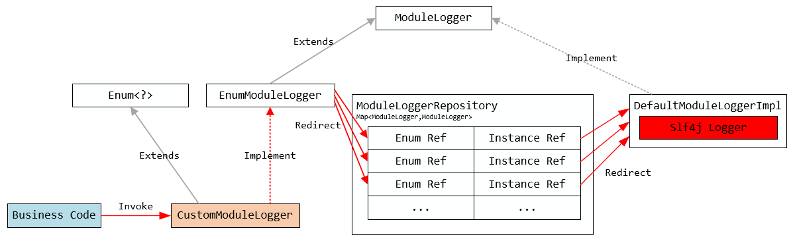

# Feego Common

[](https://www.apache.org/licenses/LICENSE-2.0)
[](https://maven-badges.herokuapp.com/maven-central/io.github.lvyahui8/feego-common-web-starter)
[](https://github.com/lvyahui8/feego-common/releases)

## 基础能力列表

- [x] [模块化日志](/readme.assets/logging.md)
- [x] 统一的异常处理/响应封装
- [ ] [统一的加签验签](/readme.assets/signature.md)
- [x] [基于redis的分布式锁](/readme.assets/lock.md)
- [ ] Dubbo扩展
- [ ] 基于注解的分级权限控制
- [ ] JWT颁发与验证
- [ ] HTTP与RPC接口Mock能力
- [x] [GUID Generator](/readme.assets/guid.md)

## 模块说明


- feego-common-configuration-processor ： 编译器相关的注解处理器
- feego-common-logging ： 模块化日志核心
  - feego-common-logging-starter：模块化日志自动配置
- feego-common-service
  - feego-common-service 
  - feego-common-service-starter
- feego-common-web
  - feego-common-web：web http相关的通用能力核心
  - feego-common-web-starter：web http相关通用能力自动配置

测试模块

- example/feego-common-example-api：主要作为依赖包提供给第三方，声明系统暴露的API
- example/feego-common-example-api-starter：自动配置系统暴露的API，第三方引用此包
- example/feego-common-example-service：测试服务核心代码
- example/feego-common-example-start：测试服务启动类
- example/feego-common-example-client：消费测试服务的客户端程序

## Common Logging

```java
public enum CustomModuleLogger implements EnumModuleLogger { 
  campaign,
  status,
  ;
}
CustomModuleLogger.campaign.debug(LogSchema.biz("qrcode-pay")
          .of("orderId",1234).of("amount",100).of("suc",'Y'));
CustomModuleLogger.campaign.debug("hello");
CustomModuleLogger.campaign.debug("hello {}","dj");
CustomModuleLogger.campaign.debug("hello {} {}","d,","j");
CustomModuleLogger.campaign.debug("hello {} {} {} {}",'d','j','b','j');

// output to file ${user.home}/logs/general/campaign.log
2020-10-13 23:38:20.505 [DEBUG] - tid:c0a8006b36b175229cc3c410000|#|biz:qrcode-pay|#|orderId:1234|#|amount:100|#|suc:Y|#|
2020-10-13 23:38:20.505 [DEBUG] - tid:c0a8006b36b175229cc3c410000|#|msg:hello|#|
2020-10-13 23:38:20.505 [DEBUG] - tid:c0a8006b36b175229cc3c410000|#|msg:hello dj|#|
2020-10-13 23:38:20.505 [DEBUG] - tid:c0a8006b36b175229cc3c410000|#|msg:hello d, j|#|
2020-10-13 23:38:20.505 [DEBUG] - tid:c0a8006b36b175229cc3c410000|#|msg:hello d j b j|#|
```

